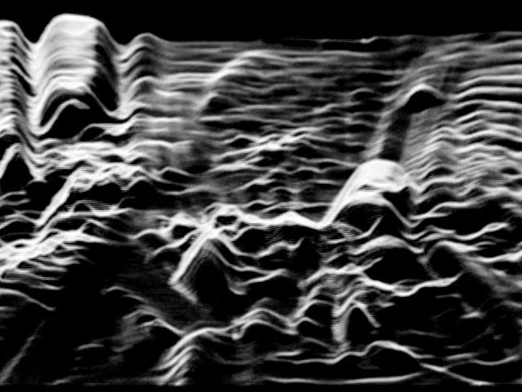
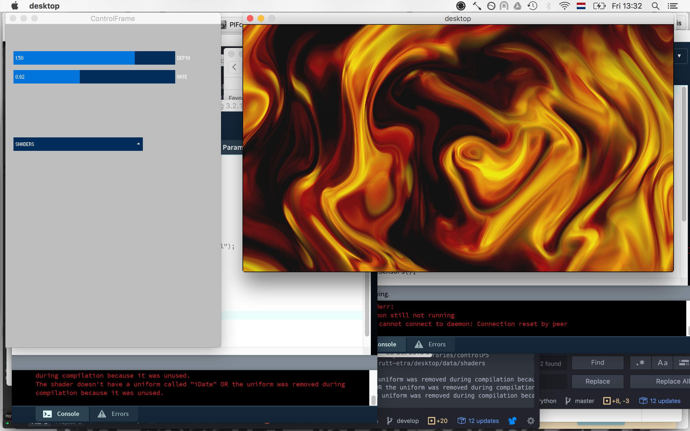

# Rutt-Etra VR machine

A VR graphic shell to experiment with shaders and sensors.



## Workflow

#### Compose your shader

You can compose your shaders using your favorite tool. Just keep in mind that to interface with the Rutt-Etra VR Machine you have to stick to the interfaces explained in [the shaders document](docs/shaders.md).

A low-entry tool for shader composition is [Shadertoy](http://www.shadertoy.com). It runs in the browser and the RE Machine is near-compatible with it (see documentation). You can run your shader there, test it in the browser and tweak it until it outputs what you want.

Other tools can be the GLSL toolkit for Atom or Sublime.

#### Define your meta parameters

When you write a shader you might want to make some of its visual features dependable of a parameter. You can define those parameters in the `.meta` files that are saved alongside the `.glsl` file.

Let's say for example that we have a shader named *Julia*. *Julia* takes two parameters,
*depth* and *complexity*. We want the *depth* parameter to have the range [4..3000] and the *complexity* parameter to range from [1..16]. Our meta file would then look something like:

```
{
  "description": "render a volumetric julia set",
  "params" : [
    {
      "name": "depth",
      "min" : 4,
      "max" : 3000,
      "mapping" : null
    },
    {
      "name": "complexity",
      "min" : 1,
      "max" : 16,
      "mapping" : null
    }
  ]
}
```

NOTE: This `.meta` file is written using JSON syntax. It must be valid JSON, otherwise the *desktop* app will fail to load it. JSON is very finicky about syntax and will fail if you are not very strict. You can validate JSON snippets using [JSONlint](http://jsonlint.com/), `.meta` files validated with this tool will be loaded just fine.

#### Test + play

This is the fun part, when you have composed your shader and defined your parameters you can run the *desktop* app, select your shader and play around with the parameters until you have the visual effect that you are after. You can use the parameter UI controls to play around.

#### Finalize and upload to Cardboard

Once you are happy with your output, simply copy the shader to `hmd/data/shaders` and re-build the Android Cardboard up so that it gets uploaded in the next sync.


## Software

The Rutt-Etra VR machine is composed of two applications written in Processing 3.

The *desktop* application can be used to compose, test and play around with your shaders, it allows you to define parameters and automatically creates a GUI for you to play around with them. The idea is that you use this desktop application to preview your shaders.

The *hmd* application runs on devices compatible with Google Cardboard. This application loads a config file that specifies which shaders to load and which order to apply them in the stack and then simply renders a rectangle using the Cardboard API, running through the shader stack. The *hmd* application also makes available the sensor readings of the android device as shader uniforms. [Read further documentation](docs/shaders.md) in the `docs` directory.

### Desktop tool

Place your shaders and meta files in `desktop/data/shaders` and open processing 3 and open the `desktop/desktop.pde` file. You should now see a rudimentary GUI that allows you to select the shader and adjust the parameters specified in the *meta* file.

The preview window will display the result of applying the shader currently selected.



NOTE: The desktop application cannot yet simulate sensor inputs from Android to provide a faithful preview. This is planned for the future, perhaps using an OSC message pump from the phone to the desktop.

### HMD viewer

Just like the desktop tool, the *HMD* viewer expects shaders to be in `data/shaders`. The *HMD* tool will ignore any `.meta` files there because it doesn't use them.
